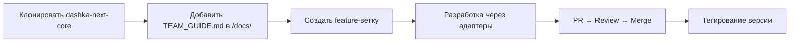

# TEAM_GUIDE.md
## 🚀 Руководство по командному взаимодействию

### 1. Структура команды и роли

**Участники команды:**
- **Dashka /** - супер сеньор проекта IIT солар, координатор, стратегическое планирование
- **Claude /** - AI помощник, техническое планирование и анализ
- **Leanid /** - архитектор проекта, технический исполнитель, показывает обратную связь
- **DeepSeek /** - AI кодер и интегратор (при необходимости)
- **Grok /** - AI технический советчик или архитектор (при необходимости)

### 2. Система идентификации в общении

**Каждое сообщение начинается с подписи роли:**

```
Dashka / Координирую процесс и стратегию
Claude / Анализирую техническую архитектуру  
Leanid / Показываю реализацию и обратную связь
DeepSeek / Пишу и интегрирую код
Grok / Консультирую по архитектуре
```

### 3. Сигнальные команды (короткие "АясЭ")

**Для быстрого понимания задач:**

| Команда | Исполнитель | Действие |
|---------|-------------|----------|
| `Л показать структуру кода` | Leanid | Выводит `tree` или содержимое файлов |
| `Dashka оформи PR-шаблон` | Dashka | Создает pull_request_template.md |
| `Claude сделай анализ` | Claude | Пишет стратегическое заключение |
| `Claude=>Leanid /` | Claude→Leanid | Запрос технической информации |
| `DeepSeek добавь код` | DeepSeek | Создает готовый модуль/компонент |
| `Grok уточни архитектуру` | Grok | Делает техническую диаграмму |

### 4. Принципы работы

**Технические принципы:**
- ✅ **Чистота ядра** - всегда отделяем шаблон от продукта
- ✅ **Один PR = одна функция** - малые контролируемые шаги
- ✅ **Документы в /docs/** - все инструкции, RFC и правила там
- ✅ **SemVer для версий** - ядро и продукты версионируем четко
- ✅ **Адаптеры для legacy** - старый код через изолированные адаптеры

**Коммуникационные принципы:**
- Краткость и четкость
- Идентификация роли в начале сообщения
- Конкретные технические детали от архитектора
- Стратегические решения от координатора

### 5. Workflow для любого проекта



**Пошагово:**
1. **Создаем проект** из шаблона `dashka-next-core`
2. **Копируем TEAM_GUIDE.md** в `/docs/`
3. **Создаем feature-ветку** для конкретной задачи
4. **Разрабатываем** через систему адаптеров (если нужен legacy код)
5. **PR → Review → Merge** с проверками CI
6. **Тегируем версию** при достижении milestone

### 6. Структура проекта

```
project-name/
├── docs/
│   ├── TEAM_GUIDE.md           # Этот файл
│   ├── CHANGELOG.md            # История изменений
│   └── architecture/           # Техническая документация
├── src/
│   ├── app/                    # Next.js App Router
│   │   ├── api/               # API endpoints
│   │   └── (products)/        # Продуктовые модули
│   ├── components/
│   │   ├── ui/                # Общие UI компоненты
│   │   └── legacy/            # Адаптеры старого кода
│   └── lib/                   # Утилиты и хелперы
├── .github/
│   ├── workflows/ci.yml       # CI/CD pipeline
│   └── pull_request_template.md
└── package.json
```

### 7. Примеры взаимодействия

**Типичный диалог при создании компонента:**
```
Dashka / Нужен адаптер для кнопки из старого проекта translator
Claude / Предлагаю MVP подход: базовые пропсы, стили, события
Л показать файл старой кнопки
Leanid / [показывает содержимое legacy файла]
Claude / Анализ: нужна типизация пропсов и адаптация стилей
DeepSeek / Создаю ButtonAdapter.tsx с TypeScript интерфейсом
Dashka / PR готов, тестируем и мержим
```

**Запрос технической информации:**
```
Claude=>Leanid / Покажи структуру папки components/
Leanid / [выводит tree components/]
Claude / Структура готова для нового адаптера
```

### 8. Definition of Done (DoD)

**Для любого PR:**
- ✅ Локально работают: `/`, `/api/health`, страница модуля
- ✅ Нет ошибок ESLint/TypeScript
- ✅ Изменения ≤ 200 строк (малый инкремент)
- ✅ Коммит по Conventional Commits
- ✅ Пройден review от другого участника команды

### 9. Версионирование

**SemVer стратегия:**
- **MAJOR** (v2.0.0) - Breaking changes в ядре
- **MINOR** (v1.1.0) - Новые функции, адаптеры, модули
- **PATCH** (v1.0.1) - Исправления багов

**Breaking changes в шаблоне:**
- Удаление/переименование API (`/api/health`, `/api/echo`)
- Изменение структуры `/src/app/(products)`
- Изменение критичных конфигов

### 10. CI/CD Pipeline

**Автоматические проверки:**
```yaml
- pnpm lint          # ESLint
- pnpm typecheck     # TypeScript  
- pnpm build         # Next.js build
```

**Branch protection (main):**
- Require PR reviews
- Require status checks
- No direct push to main

---

## 📝 Как использовать этот гайд

1. **В начале проекта** - скопировать в `/docs/TEAM_GUIDE.md`
2. **При онбординге** - изучить роли и команды
3. **В процессе работы** - использовать как справочник
4. **При масштабировании** - адаптировать под новые роли

**Этот документ живет в каждом проекте и обеспечивает единообразие командного взаимодействия.**